<h1 align="center">Nayan Nath</h1>

  <picture>
    <source media="(prefers-color-scheme: dark)" srcset="https://raw.githubusercontent.com/nayan07cse/nayan07cse/output/github-contribution-grid-snake-dark.svg">
    
  </picture>

  

  

  

  

